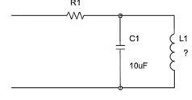

# Project_2-1

## Description

This is a [LibrePCB](https://librepcb.org) project!
Just edit this file to add a description about it.

* Build a parallel resonant circuit for a frequence of 50Hz.

* A 10uF capacitor is compulsory to be used.
* In order to minimize the nominal value of the inductor, an equivalent element with operational amplifiers, resistors and capacitors must be used.

## Components
* Operational amplifier: LM741, TL071, TL081 or equivalent
* Resistors and capacitors
* Input voltage of +/-12V or +5V

## Solution
For a frequence of 50Hz, it is necessary to use an inductance of 1H. This inductance can be calculated knowing that f = 1//(2*pi*sqrt(C1*L1)).
This time, it is used a circuit with two operational amplifiers in order to make the simulated inductance independant of the frequence. The equivalent inductance on this circuit: Leq = (R2*R3*R5)*C2/R2.
R2 = 1k; R3 = 1k, R4 = 10k; R5 = 1k; C2 = 10uF

## License

See [LICENSE.txt](LICENSE.txt).
