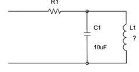

# Project_2

## Description
This is a [LibrePCB](https://librepcb.org) project!

* Build a parallel resonant circuit for a frequence of 50Hz.

* A 10uF capacitor is compulsory to be used.
* In order to minimize the nominal value of the inductor, an equivalent element with operational amplifiers, resistors and capacitors must be used.

## Components
* Operational amplifier: LM741, TL071, TL081 or equivalent
* Resistors and capacitors
* Input voltage of +/-12V or +5V

## License

See [LICENSE.txt](LICENSE.txt).
